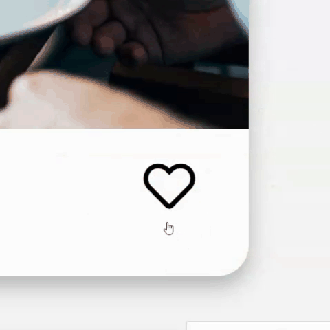

<h1 align="center">
</h1>

<h3 align="center">An online food ordering service</h3>

># **[ohmyfood Live Webpage link](https://dylannicolet.github.io/Front-End-P3-OpenClassrooms/)**

>## **In a few words**
The concept will allow users to compose their own menu from gastronomic restaurants and reduce waiting time in restaurants because they make their choice in advance.

Target customers:  Middle and upper class people who are connected and often in a hurry, wishing to taste
quality products.

>## **Developement technologies used**
* HTML and CSS only
* With SASS pre-compiler
* No Javascript or framework allowed
* No style attribute should be used on the HTML files

>## **Key requirements for the project and a visual of the live results**
1. Create a loading spinner for the homepage with a design consistent with the graphic charter provided.

2. The Heart shape icon should fill up gradually when hovered on.

3. The main buttons should lighten slightly and their drop shadow be more visible when hovered on.

4. When arriving on a restaurant's page, the meals should appear gradually with a slight time lag.

5. When hovering over a meal, a checkmark should slide in from the right side of the meal.

6. If the title of the dish is too long, it should be trimmed with suspension points automatically.

7. Design the tablette and desktop layout which were not provided by the UX/UI designer.

>## **Learning goals of this project**
* Create a navigation structure for the website's developement files.
* Understand and implement animations via **CSS and SASS**
* Ensure design consistency and easy maintanability for the futur, leveraging **SASS**.

>## **Challenges faced**
* Completing the SASS and animation course on OPC which was very tedious for me.

>## **Goals achieved?**

Absolutely 100%

